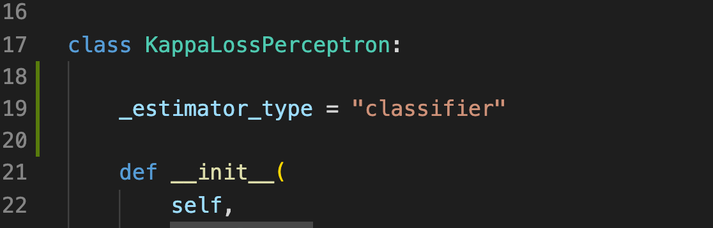
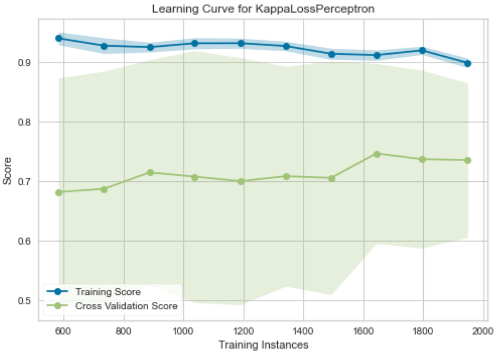

TODO: 
- https://www.scikit-yb.org/en/latest/api/features/pca.html
- https://www.scikit-yb.org/en/latest/api/classifier/index.html
- double check categorical/1-hot features are working correctly
- MAYBE try [custom loss for xgboost](https://towardsdatascience.com/custom-loss-functions-for-gradient-boosting-f79c1b40466d) IF THERE's time
- [ordinal-ify](https://stackoverflow.com/questions/54927571/ordinal-logistic-regression-intercept-returns-1-instead-of-n) NN?
- possibly choose better ordinal [regression](https://github.com/fabianp/mord/blob/master/mord/threshold_based.py): 

first, did all the normal stuff

- ensure stratification
	- default for gridsearch, if classifier, had to reimpliment for perceptron AND mord
	-  

- write about [cohen's kappa](https://www.knime.com/blog/cohens-kappa-an-overview)
- properly collect model outputs from nested kfold loop
	- [doesn't matter at this stage](https://machinelearningmastery.com/nested-cross-validation-for-machine-learning-with-python/)

We have some clean data. Now we can thing about modeling, starting with transformations.

0) Ensure categorical features are identified and encoded as such
	- All features are continuous with the exception of `Tendency` which is ordinal (and can still be treated as continuous)
1) We want to normalize everything that's scalar so that regularization works properly
2) We'll want to try out a PCA step since many inputs are correlated
3) Because of class imbalance, we'll want to at least think about options like SMOTE
### For training:
1) We have a smaller dataset, so a nested k-fold will work. The inner fold is for hyperparam optimization, the outer is for evaluating model performance. 
2) We have imbalanced classes so k-folding should be stratified by class
### For modeling, we need to choose classification models. 
1) we're dealing with an ordinal regression, not just classification. 
2) We need to think of smart error metrics

Goal: Add in learning curve with one model and see how scalable it is to use on a basked

Sometimes when you want to debug, you just a get a lot of "abstract" data types. I found it's helpful to temporarily disable JIT

jaxified the kappa scorer, and made the scorer more continuous

compilation was really slow, so need remove a for loop and "jaxify" everything

part I
        cm = jnp.zeros((self.num_classes, self.num_classes))
        for i in range(len(y_pred)):
            x = y_true[i]
            y_p = y_pred[i]
            cm = cm.at[x, :].add(y_p)
        return cm

part II (but can't have dynamic size so didn't work)
        # y_true = jnp.expand_dims(y_true, axis=1)
        # cm = jnp.zeros((self.num_classes, self.num_classes))
        # for i in jnp.unique(y_true):
        #     cm = cm.at[i].set(y_pred[(y_true[:, 0] == i)].sum(axis=0))
        # return cm

part III
Note the "num classes" variable can't be set dynamically if the function is to be jit compiled because it leads to dynamic size arrays which is not allowed. 
    def confusion_matrix_continuous(self, y_true, y_pred):
        """
        A confusion matrix that support continuous class probabilities, i.e.
        the output of a softmax layer.
        It also outputs a continuous valued confusion matrix. Since it's part
        of our loss function, this gives us a continous loss instead of a
        discrete one.
        """

        def f(i, j):
            """
            for each probability column j in y_true, sum the probabilities of
            of getting the expected answer for each expected answer i
            """
            return jnp.where(y_true == i, y_pred[:, j], 0).sum()

        vecs = vmap(vmap(f, in_axes=(0, None)), in_axes=(None, 0), out_axes=1)(
            jnp.arange(self.num_classes),
            jnp.arange(self.num_classes),
        )
        return vecs

While before compilation could take as long as 40 minutes when using full data, it went down to less than a second

At first the perceptron was being beaten by logistic regression, which was odd because they are pretty similar. Looking closer I found I couldn't even overfit all the data very well on the model, so something seemed off. It turned out that was true: I was missing a bias term.

After adding I could overfit to .84 kappa on the entire dataset, but I should be able to overfit nearly perfectly, so I rejiggered the code to add another layer (and easily add even more). At first I tried relu as the hidden activation, but it didn't work. I switch to tanh, and things got better. Not sure why???

I could have switched to something more out of the box like haiku, but I wanted to refresh my memory on the inner workings of NNs and also learn Jax nuts and bolts better

Of course once overfitting, now we need to worry about regularization. Start by looking at a learning curve 

How does automatic differentiation work? Seems magical (bad!)